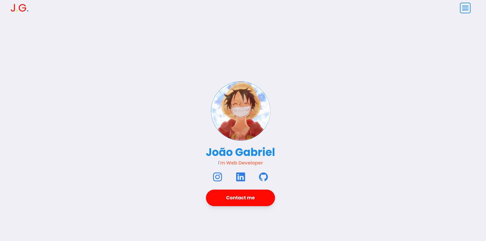

# My Personal Portfolio



Meu projeto de protifólio pessoal criado para ser a minha porta de entrada para que outros possam me conhecer e acompanhar o meu desenvolvimento. 💙

## Quer me conhecer agora mesmo?

[Clique aqui](https://portfolio-roan-ten-92.vercel.app/) para visualizar meu portifólio.
## Rodando localmente

Clone o projeto

```bash
  git clone https://link-para-o-projeto
```

Entre no diretório do projeto

```bash
  cd my-project
```

Inicie o servidor

```bash
  npm run dev
```


## Stack utilizada

<div style="display: flex">
  
  
</div>


## Funcionalidades

O projeto é simples e fácil de usar, possuindo, por enquanto, somente algumas funções.

- Escolher navbar
- Visualizar deploy dos projetos
- Visualiar código  
- Enviar email


## Feedback

Se você tiver algum feedback, por favor deixe-me saber enviando um email para joaogabriel9633@gmail.com
